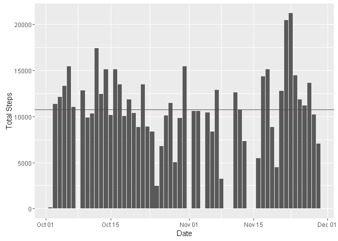
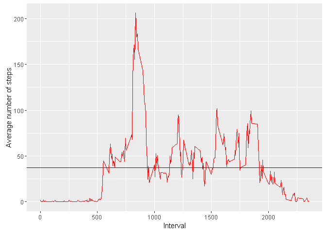
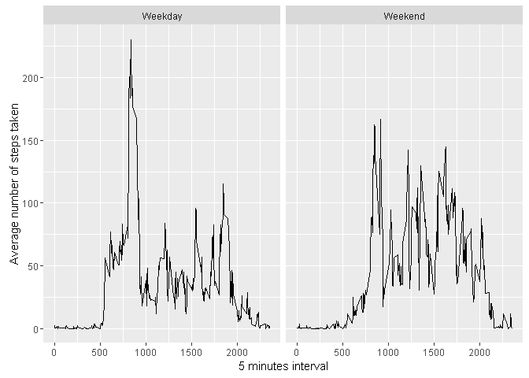

# Reproducible Research: Peer Assessment 1


## Loading and preprocessing the data

```r
# if(!exists("data")) {
if(!file.exists("activity.csv")) {
  activity <- unzip("activity.zip")
}
  data <- read.csv("activity.csv")


data_noNA<- subset(data,data$ steps != 'NA')
data_noNA[, 2]<- as.Date(data_noNA[, 2])
```


## What is mean total number of steps taken per day?

```r
library(dplyr)
```

```
## 
## Attaching package: 'dplyr'
```

```
## The following objects are masked from 'package:stats':
## 
##     filter, lag
```

```
## The following objects are masked from 'package:base':
## 
##     intersect, setdiff, setequal, union
```

```r
library(ggplot2)
```

```
## Warning: package 'ggplot2' was built under R version 3.2.5
```

```r
total_steps <- data_noNA %>%
  group_by(date) %>%
  summarize(total = sum(steps)) %>%
  print()
```

```
## Source: local data frame [53 x 2]
## 
##          date total
##        (date) (int)
## 1  2012-10-02   126
## 2  2012-10-03 11352
## 3  2012-10-04 12116
## 4  2012-10-05 13294
## 5  2012-10-06 15420
## 6  2012-10-07 11015
## 7  2012-10-09 12811
## 8  2012-10-10  9900
## 9  2012-10-11 10304
## 10 2012-10-12 17382
## ..        ...   ...
```

```r
data_mean <- mean(total_steps$total, na.rm = TRUE)
data_median <- median(total_steps$total, na.rm = TRUE)

print(paste("Mean of the total number of steps:",
            as.numeric(data_mean), sep = " "))
```

```
## [1] "Mean of the total number of steps: 10766.1886792453"
```

```r
print(paste("Median of the total number of steps:",
            as.numeric(data_median), sep = " "))
```

```
## [1] "Median of the total number of steps: 10765"
```

```r
g <- ggplot(total_steps, aes(date, total))
g <-
  g + geom_bar(stat = "identity") + geom_hline(yintercept = data_mean, color ="red")
g <- g + xlab("Date") + ylab("Total Steps")
print(g)
```




## What is the average daily activity pattern?

```r
total_inv<- data_noNA%>%
  group_by(interval) %>%
  summarize(mean=mean(steps))%>%
  print()
```

```
## Source: local data frame [288 x 2]
## 
##    interval      mean
##       (int)     (dbl)
## 1         0 1.7169811
## 2         5 0.3396226
## 3        10 0.1320755
## 4        15 0.1509434
## 5        20 0.0754717
## 6        25 2.0943396
## 7        30 0.5283019
## 8        35 0.8679245
## 9        40 0.0000000
## 10       45 1.4716981
## ..      ...       ...
```

```r
g1<- ggplot(total_inv,aes(interval,mean))
g1<- g1+geom_line(color="red")
g1<- g1+xlab("Interval")+ylab("Average number of steps")
g1<- g1+geom_hline(yintercept = mean(total_inv$mean),color="blue")
print(g1)
```



```r
print(paste(("Maximum number of steps:"), (as.character(max(total_inv$mean))), sep = ""))
```

```
## [1] "Maximum number of steps:206.169811320755"
```


## Imputing missing values

```r
num_NA<- data[is.na(data$steps),]
num_NA$date<- as.Date(num_NA$date)
print(paste(("Number of row of missing value:"),as.numeric(nrow(num_NA)), 
            sep = " "))
```

```
## [1] "Number of row of missing value: 2304"
```

```r
data_all<- merge(data, total_inv, by="interval")
NAindex<- which(is.na(data_all$steps))
data_all[NAindex,"steps"]<- data_all[NAindex,"mean"]
data_all<- arrange(data_all, date)

total_steps_all<- data_all%>%
                  group_by(date)%>%
                  summarize(sum=sum(steps))%>%
                  print()
```

```
## Source: local data frame [61 x 2]
## 
##          date      sum
##        (fctr)    (dbl)
## 1  2012-10-01 10766.19
## 2  2012-10-02   126.00
## 3  2012-10-03 11352.00
## 4  2012-10-04 12116.00
## 5  2012-10-05 13294.00
## 6  2012-10-06 15420.00
## 7  2012-10-07 11015.00
## 8  2012-10-08 10766.19
## 9  2012-10-09 12811.00
## 10 2012-10-10  9900.00
## ..        ...      ...
```

```r
total_steps_all$date<- as.Date(total_steps_all$date)

g <- ggplot(total_steps_all, aes(date, sum))
g <-
  g + geom_bar(stat = "identity") 
g <- g + xlab("Date") + ylab("Total Steps")
g<- g+geom_hline( yintercept  = mean(total_steps_all$sum), color="red")
print(g)
```


```r
print(paste("Mean of number of steps of fill in missing value:", 
            as.numeric(mean(total_steps_all$sum)), sep = " "))
```

```
## [1] "Mean of number of steps of fill in missing value: 10766.1886792453"
```

```r
print(paste("Median of number of steps of fill in missing value:", 
            as.numeric(median(total_steps_all$sum)), sep = " "))
```

```
## [1] "Median of number of steps of fill in missing value: 10766.1886792453"
```
There is no difference with the first part of assignment as the mean for both is the same. No impact of inputting missing data as the mean and median are the same.


## Are there differences in activity patterns between weekdays and weekends?

```r
data_all$date<- as.Date(data_all$date)
data_days<- data_all
data_days<- mutate(data_days,days = weekdays(date))

cols<- ncol(data_days)

for (i in 1:nrow(data_days) ) {
  if(data_days[i,5] == "Saturday" || data_days[i,5] == "Sunday"){
    data_days[i,cols+1]<- "Weekend"
  }else{
    data_days[i,cols+1]<- "Weekday"
  }
}


data_days$V6<- as.factor(data_days$V6)

mean_interval1<- data_days%>%
  group_by(interval, V6) %>%
  summarize(mean=mean(steps))%>%
  print()
```

```
## Source: local data frame [576 x 3]
## Groups: interval [?]
## 
##    interval      V6        mean
##       (int)  (fctr)       (dbl)
## 1         0 Weekday 2.251153040
## 2         0 Weekend 0.214622642
## 3         5 Weekday 0.445283019
## 4         5 Weekend 0.042452830
## 5        10 Weekday 0.173165618
## 6        10 Weekend 0.016509434
## 7        15 Weekday 0.197903564
## 8        15 Weekend 0.018867925
## 9        20 Weekday 0.098951782
## 10       20 Weekend 0.009433962
## ..      ...     ...         ...
```

```r
g<- ggplot(mean_interval1,aes(interval, mean))
g<- g+geom_line()+facet_grid(.~V6)
g<- g+ylab("Average number of steps taken")+xlab("5 minutes interval")
print(g)
```



